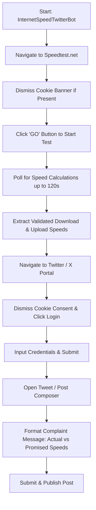

# 🚀 Internet Speed Twitter/X Complaint Bot

[](https://www.python.org/)
[](https://www.selenium.dev/)
[](https://www.speedtest.net/)
[](https://x.com/)
[](https://opensource.org/licenses/MIT)

An automated internet speed testing and ISP accountability bot built with Python and **Selenium WebDriver**. The bot tests real-time download and upload bandwidth on **Speedtest.net**, compares the results against your ISP contract's promised speeds, and automatically logs in to **Twitter / X** to compose and publish a tweet holding your provider accountable.

---

## 🌟 Key Features

- **Automated Speed Testing**: Navigates to [Speedtest.net](https://www.speedtest.net/), dismisses cookie consent dialogs, and triggers the bandwidth assessment.
- **Robust Polling & Float Validation**: Actively polls speed metrics up to 120 seconds, ensuring speeds are completely calculated and validated as floating-point numbers before proceeding.
- **Automated Social Publishing**: Logs in to Twitter/X (or mock X service), opens the tweet composer, drafts a formatted complaint mentioning actual vs. promised speeds, and publishes the post.
- **Environment-Driven Configuration**: Secures all user credentials, promised speeds, and endpoints with `python-dotenv`, keeping sensitive information out of version control.

---

## 🏗️ Architecture & Interaction Flow



---

## 📁 Project Structure

```
DAY-51/
├── .env.example        # Template for credentials and speed limits
├── .gitignore          # Excludes .env, bytecode, and virtual environments
├── main.py             # Complete speed test bot and tweet automator
└── README.md           # Project documentation
```

---

## 🚀 Getting Started

### Prerequisites

- **Python 3.10+** installed
- **Google Chrome** browser installed
- Selenium 4+

### 1. Clone the Repository

```bash
git clone https://github.com/dibyasarothidibya-lang/Internet-Speed-Twitter-Bot.git
cd Internet-Speed-Twitter-Bot
```

### 2. Set Up a Virtual Environment

```bash
python -m venv venv
# On Windows:
venv\Scripts\activate
# On macOS/Linux:
source venv/bin/activate
```

### 3. Install Dependencies

```bash
pip install selenium python-dotenv
```

### 4. Configure Environment Variables

Copy `.env.example` to `.env`:

```bash
cp .env.example .env
```

Open `.env` and fill in your credentials and promised bandwidth:

```ini
# Twitter / X Credentials
TWITTER_EMAIL=your_email@example.com
TWITTER_PASSWORD=your_password_here

# Contract Speeds (in Mbps)
PROMISED_DOWN=150
PROMISED_UP=10
```

---

## 💻 Usage

Run the bot:

```bash
python main.py
```

### Sample Output

```text
Download Speed: 42.15
Upload Speed: 4.80
```

**Published Tweet Format:**
> *"Hey Internet Provider, why is my internet speed 42.15Mbps down / 4.80Mbps up when I pay for 150Mbps down / 10Mbps up?"*

---

## 🛠️ Built With

- **Python** - Core automation logic
- **Selenium WebDriver** - Headless and browser automation
- **ChromeOptions** - Custom browser configurations
- **python-dotenv** - Secure environment variable management

---

## 📜 License & Acknowledgments

- Built as part of **Day 51** of the *100 Days of Code: The Complete Python Pro Bootcamp* by Dr. Angela Yu.
- Distributed under the MIT License.
